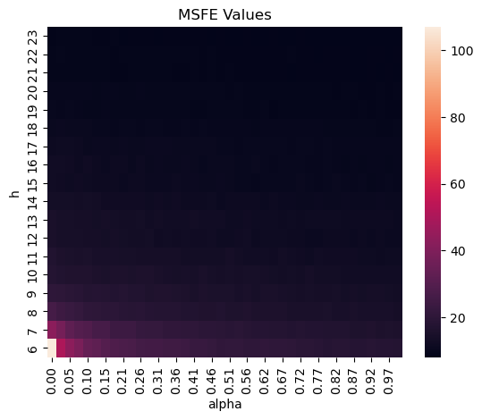

# Simple Moldtsova and Papell Strategy
## Hyperparameters Tunning
#### ECON 409 Project Proposal

*Idalee Vargas, Lora Yovcheva, Mauricio Vargas, Santiago Naranjo*

---

As a reminder, the proposed model consists of:

$$
\Delta s_{t+1} = \beta_0 + 
    \beta_1(\tilde{\pi}_{t-1} - \pi_{t-1}) +
    \beta_2(\gamma_1^2 \tilde{y}_{t-2} - \alpha_1 y_{t-1}) +
    \epsilon_t
$$

Where:

- $\Delta s_{t+1}$: Difference in the logarithms of the exchange rate at $t+1$.
- $\pi_{t-1}$: Inflation in the United States at $t-1$.
- $\tilde{\pi}_{t-1}$: Inflation in the United Kingdom at $t-1$.
- $y_{t-1}$: Output gap in the United States at $t-1$.
- $\tilde{y}_{t-2}$: Output gap in the United Kingdom at $t-2$.

---

## Ridge Regression

We define the loss function as:

$$
L(\widehat{\Delta s}_{t+1} \vert \beta_0, \beta_1, \beta_2) = 
    MSE(\widehat{\Delta s}_{t+1}) + 
    \lambda \sum_{i = 0}^{2} \beta_i^2
$$

where:

$$
\beta^* = (\beta^*_0, \beta^*_1, \beta^*_2)' = 
\text{arg min}_{\beta \in \mathbb{R}^3} L(\widehat{\Delta s}_{t+1} \vert \beta)
$$

---

## Tuning Parameters

1. $\lambda$: Regularization term in ***Ridge*** regression.
2. $h$: Rolling window size for model estimation and the output gaps, to avoid including structural breaks that could affect forecasts.

---

## Hyperparameter Selection Procedure

### Detailed Algorithm

A value for $\lambda$ and a time window size $h$ are selected, where $\lambda$ is the regularization parameter for Ridge regression and $h$ represents the size of the time window of the sample to estimate a model.

Considering that $T$ observations are available, the process proceeds as follows using the first $h$ data of the sample:

---

1. The Akaike Information Criterion (AIC) is calculated for the selected sample. A bootstrap method is used on the residuals to generate an extended sample of these up to a total of 10,000 residuals, from which the AIC is calculated.

2. An out-of-sample forecast is made for the period $h+1$, and the error of this forecast is calculated.

This procedure is repeated by shifting the time window forward by one period in each iteration. For example, the second iteration covers from $t = 2$ to $t = h + 1$, and so on until the last iteration includes data from $t = T - h - 1$ to $t = T - 1$.

---

This process generates two vectors: one with the AIC values calculated in each time window and another with the squared errors one period ahead out-of-sample. The values of both vectors are averaged to obtain an average AIC and a Mean Squared Forecast Error (MSFE) for the specific configuration of $\lambda$ and $h$ chosen.

---

    
Algorithm Pseudocode

    
<strong>Inputs:</strong>

    <ul>
        <li>T: total number of available observations.</li>
        <li>lambda: regularization parameter for Ridge regression.</li>
        <li>h: time window size for the sample.</li>
    </ul>
    
<strong>Process:</strong>

    <ol>
        <li>Initialize empty AIC_vector and MSFE_vector arrays.</li>
        <li>For each time window from t=1 to t=T-h do:
            <ol type="a">
                <li>Select the data sample corresponding to the window [t, t+h-1].</li>
                <li>Estimate the Ridge regression model with the current window data:
                     Model: Δs_t+1 = β0 + β1(π̃_t-1 - π_t-1) + β2(γ1² ỹ_t-2 - α1 y_t-1) + ε_t</li>
                <li>Calculate the AIC for the estimated model.</li>
                <li>Apply bootstrap to the model residuals to generate an extended sample of 10000 residuals.</li>
                <li>Calculate the AIC using the extended sample of residuals.</li>
                <li>Perform an out-of-sample forecast for the period t+h and calculate the forecast error.</li>
                <li>Add the AIC calculated in step 2.5 to the AIC_vector.</li>
                <li>Add the forecast mean square error to the MSFE_vector.</li>
            </ol>
        </li>
        <li>Calculate the average AIC from the values in AIC_vector.</li>
        <li>Calculate the average MSFE from the values in MSFE_vector.</li>
    </ol>
    
<strong>Outputs:</strong>

    <ul>
        <li>Average AIC: average value of the AIC calculated across all time windows.</li>
        <li>Average MSFE: average value of the out-of-sample mean square forecast error.</li>
    </ul>

---

## Results: GridSearch With MSFE

    

---

- It can be noted that with small time windows, the prediction error increases. This is because it's not possible to collect enough observations to properly estimate the linear model, as well as to estimate the output gaps.
- Additionally, it's observed that from a sample of 12 months and a ridge parameter close to 0.2, the forecasts do not show a significant improvement.

---

## Results: GridSearch With AIC

    

---

- The AIC criterion can be used as an estimator for out-of-sample error. According to our results, the smallest window without penalty has the best balance between bias and variance.

- This result is counterintuitive and arises from the resampling method of errors, indicating that further research is necessary.
